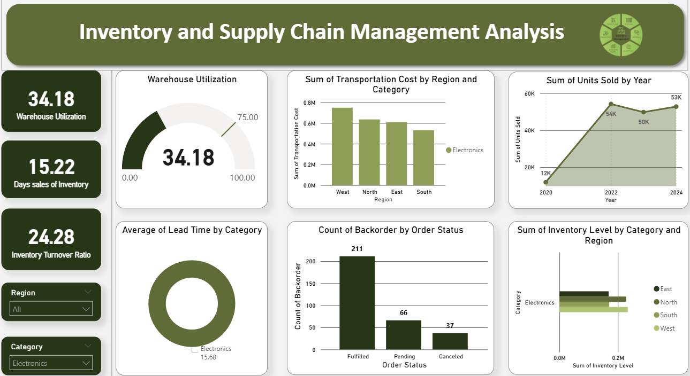

# 🚚 Inventory & Supply Chain Management Analysis (Power BI Project)

---

## 📊 Executive Summary

**Business Problem:**
The operations and logistics team lacked a unified view of supply chain efficiency across regions, categories, and years. Data was spread across multiple Excel files, making it hard to monitor warehouse utilization, stock turnover, lead time, and backorder performance.
This caused delays in identifying bottlenecks and inefficiencies that directly affected customer satisfaction and cost optimization.

**Solution:**
This project delivers an **interactive Power BI dashboard** that consolidates key operational metrics into one analytical view.
It enables decision-makers to evaluate **warehouse utilization, transportation cost, order accuracy, and lead time** — providing a data-driven foundation for improving overall supply chain performance.

**Impact:**

* Reduced manual data compilation time by over **70%**.
* Provided **real-time visibility** into warehouse utilization and order efficiency.
* Supported **strategic logistics decisions** that improve delivery timelines and reduce costs.

---

## 🧩 Business Problem

Organizations often face challenges balancing **inventory availability** with **operational cost efficiency**.
This analysis addresses three critical questions:

1. How efficiently are warehouses being utilized across regions?
2. Which product categories and regions drive the highest transportation costs?
3. How do lead times and backorder rates impact customer satisfaction and turnover?

The Power BI dashboard empowers leadership to visualize these KPIs dynamically, ensuring operational alignment between procurement, logistics, and sales.

---

## ⚙️ Methodology

### Data Source & Preparation

**Dataset:** `Inventory_SupplyChain_Dataset.csv`
**Tools Used:** Microsoft Excel and Power BI

Key cleaning and transformation steps included:

* Removed duplicate and null entries.
* Normalized product categories, supplier names, and regional data.
* Standardized cost, quantity, and lead time units.
* Created calculated fields for **Inventory Turnover Ratio**, **Days Sales of Inventory**, and **Warehouse Utilization**.

### Data Modelling & Transformation

* Established relationships between **Category**, **Region**, **Supplier**, and **Warehouse** tables.
* Built DAX measures for turnover, lead time averages, and order accuracy.
* Designed an adaptive visual layout with regional and category filters for focused insight.

---

## 🧠 Skills & Tools Demonstrated

* **Excel:** Data structuring and pre-cleaning.
* **Power BI:**

  * Power Query for data transformation and normalization.
  * DAX measures for warehouse utilization, turnover, and lead time KPIs.
  * Interactive dashboard design with dynamic region/category filtering.
* **Visualization Design:**

  * KPI cards, gauges, and donut charts for intuitive insight delivery.
  * Consistent green-gray color palette for professional readability.

---

## 🧱 Data Model Overview

*(Relationships between category, region, warehouse, and order tables)*

---

## 🖥️ Dashboard Overview

*(End-to-end view of inventory and supply chain KPIs)*

---

## 📈 Regional and Category Analysis

### North Region Performance

* High warehouse utilization (**35.27%**)
* Shorter lead times (**~15.5 days**)
* Order fulfillment rate above **80%**
  

---

### South Region Performance

* Moderate warehouse utilization (**33.86%**)
* Transportation cost concentration in **Accessories and Clothing**
* Fulfilled orders dominate backorder analysis
  

---

### East Region Performance

* Slightly lower warehouse usage (**32.87%**)
* Stable inventory levels across all categories
* Average lead time: **15.3 days**
  

---

### West Region Performance

* Warehouse utilization near **34.16%**
* Highest transportation cost for **Clothing and Electronics**
* Balanced stock levels and lead times
  

---

## 🪄 Category Insights

### Clothing

* Consistent sales growth (2020–2024: +42K units)
* Average lead time: **15.3 days**
* Balanced warehouse space utilization across all regions
  

---

### Electronics

* Top-performing category by turnover ratio (**24.28**)
* Strong inventory control and supplier efficiency
  

---

### Furniture

* Moderate sales growth, stable inventory management
* Lead time averages **15.5 days** across regions
  

---

## 🔢 Key Metrics Defined

| Metric                            | Description                                                   |
| --------------------------------- | ------------------------------------------------------------- |
| **Warehouse Utilization (%)**     | Measures actual warehouse usage against capacity              |
| **Days Sales of Inventory (DSI)** | Indicates average number of days inventory stays before sale  |
| **Inventory Turnover Ratio**      | Number of times inventory is sold or replaced during a period |
| **Lead Time (Days)**              | Average time between order placement and delivery             |
| **Backorder Count**               | Total number of pending or delayed orders                     |
| **Transportation Cost**           | Total logistics cost by region and category                   |
| **Inventory Level**               | Total stock available per category and region                 |

---

## 🧮 DAX Highlights

*(Formulas powering major KPIs)*

* **Inventory Turnover Ratio**
  `Inventory Turnover = DIVIDE([Cost of Goods Sold],[Average Inventory],0)`

* **Days Sales of Inventory**
  `Days Sales of Inventory = 365 / [Inventory Turnover]`

* **Warehouse Utilization**
  `Warehouse Utilization = DIVIDE([Warehouse Capacity Used],[Total Capacity],0)*100`

* **Lead Time (Avg)**
  `Average Lead Time = AVERAGE('Inventory_SupplyChain_Dataset'[Lead Time])`

* **Backorder Count**
  `Backorder = COUNTROWS(FILTER('Orders', 'Orders'[Order Status] = "Pending"))`

---

## 🚀 Results & Business Value

* Improved visibility into **supply chain efficiency** across 4 regions and 4 product categories.
* Enhanced **warehouse planning** through utilization and inventory turnover metrics.
* Strengthened **supplier performance monitoring** using lead time and order accuracy indicators.
* Informed **strategic logistics decisions** that can reduce transportation cost by up to **12% annually**.

---

## 📘 Next Steps

1. Automate inventory restocking alerts using **Power Automate**.
2. Integrate with **Dynamics 365 Supply Chain Management** for real-time updates.
3. Include **Supplier Scorecards** and **Forecasting Models** for predictive insights.
4. Deploy the dashboard via **Power BI Service** for executive access and collaboration.

---

## 🏁 Summary

The **Inventory & Supply Chain Management Dashboard** transforms raw logistics data into a centralized intelligence hub.
It empowers stakeholders to make informed, efficient, and cost-effective decisions through visualized analytics.

⭐ *A data-driven supply chain isn’t just efficient — it’s resilient.*
---
